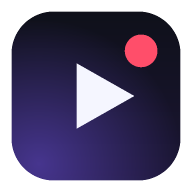

# ClipMind

Record the video you're watching, get the transcript, then tell Claude or ChatGPT what to do with it.

It's a web app that installs to your Home Screen like a normal app — no App Store, no Xcode, no account.
Your recordings stay on your phone; the only things that ever leave are the audio you choose to transcribe
and the transcript you choose to ask about, sent straight to your own API key.

<p align="center"></p>

---

## What it does

1. **Capture** — record the screen with its sound (desktop, Android), listen along with the microphone,
   or import a screen recording your phone already made (this is the iPhone route).
2. **Transcribe** — upload the audio to OpenAI Whisper for a timestamped transcript, use the browser's own
   live recogniser for free, or paste a transcript you already have.
3. **Ask** — the app then asks *what do you want to do with this?* and offers: summarise, key takeaways,
   action items, step-by-step guide, chapters, study notes, quiz, claim check, social post, detail
   extraction, translation, or any question of your own. Answers stream in, and you can keep asking
   follow-ups in the same thread. **Suggest** asks the model to propose four things worth doing with
   *this particular* video.

Tick **also send still frames** and it samples frames evenly through the video and sends them with the
transcript, so the model can answer about things that were shown rather than said.

---

## Get it on your Home Screen

The app is static files, so anything that serves HTTPS will host it. The quickest is GitHub Pages:

1. In this repo: **Settings → Pages → Source: GitHub Actions**.
2. Merge this branch into `main` (or run the **Deploy to GitHub Pages** workflow by hand from the
   Actions tab). It publishes in about a minute.
3. Open `https://lx2rice.github.io/video-recording-/` on your phone.
4. **iPhone:** Safari → Share → *Add to Home Screen*.
   **Android:** Chrome → menu → *Install app* (or tap the **Install** button in the app's header).

HTTPS matters: the microphone and screen capture are blocked on plain `http://`, with `localhost`
the one exception.

Then open **Settings** in the app and paste an API key:

| You want | Get a key from | Cost, roughly |
|---|---|---|
| Claude to answer | [console.anthropic.com](https://console.anthropic.com/settings/keys) | a few cents per summary of a long video |
| ChatGPT to answer | [platform.openai.com](https://platform.openai.com/api-keys) | similar; `gpt-4o-mini` is the cheap option |
| Whisper transcripts | same OpenAI key | about $0.006 per minute of audio |

Whisper is OpenAI's, so transcribing needs an OpenAI key even when Claude writes the answers. Don't want
that? Set **Transcription** to *Live in the browser* (free) or *Paste it myself*.

---

## Using it on an iPhone

Safari gives no web app access to the screen, so the built-in recorder does that job:

1. Add **Screen Recording** to Control Centre once (Settings → Control Centre).
2. Swipe down, tap ⏺, and start the video you want to keep.
   Long-press the ⏺ button first and switch the **microphone off** — you want the video's own sound.
3. Stop recording. iOS saves it to Photos.
4. Open ClipMind → **Import a recording** → pick it → it transcribes and asks what you want done.

**Listen along** is the quick alternative: it records through the microphone while the video plays out
loud on another device. No screen needed, but not if you're wearing headphones.

On a laptop or Android, **Record the screen** does everything in one step — pick the tab and tick
*share tab audio* so the sound is captured cleanly rather than through the room.

---

## Where your data goes

- Recordings, transcripts and answers are stored in the browser's IndexedDB **on the device only**.
  Nothing syncs. Clearing the site's data or deleting the app's data wipes them.
- API keys sit in `localStorage` on that device and are sent only to the API you chose.
- Audio is uploaded **only** when you transcribe; the transcript is uploaded **only** when you ask a
  question. Nothing else is transmitted, and the app has no backend.
- Long recordings are split into pieces under the upload limit before transcription — the audio is
  extracted, downmixed to 16 kHz mono and cut at quiet moments, so nothing is lost mid-word.

### Keys on a server instead

If you'd rather not keep keys on the phone, run the bundled proxy on a machine you control:

```bash
ANTHROPIC_API_KEY=sk-ant-… OPENAI_API_KEY=sk-… node server.js
```

Put that server's URL in **Settings → Proxy URL** and the app stops sending keys entirely — the proxy
adds them and forwards only to the two APIs it knows about. It also serves the app itself, so
`http://localhost:8080` is a complete local install.

**Record only what you're entitled to record.** Some things you watch are copyrighted, and in some
places recording other people needs their consent.

---

## Running it locally

```bash
git clone https://github.com/lx2rice/video-recording-.git
cd video-recording-
node server.js          # → http://localhost:8080
```

No build step, no dependencies, Node 18+ only for the server (any static file server works too).

### What's in here

```
index.html              app shell: record / library / session / settings
styles.css              dark, phone-first
manifest.webmanifest    Home Screen identity
sw.js                   offline shell
server.js               dev server + optional key-hiding proxy
js/app.js               controller: views, recording lifecycle, actions
js/media.js             getDisplayMedia / getUserMedia / MediaRecorder, keyframes
js/audio.js             decode → 16 kHz mono → WAV → chunk for upload
js/transcribe.js        Whisper upload, live recogniser, pasted transcripts
js/ai.js                Claude + OpenAI streaming over fetch
js/prompts.js           the action menu and the prompts behind it
js/store.js             IndexedDB + settings
js/md.js                Markdown renderer (escapes everything first)
tools/make-icons.py     regenerates the icon set
```

The model calls are plain `fetch` rather than an SDK on purpose: the app ships as static files with no
build step, so it can be dropped on any host and still work from a Home Screen tile. Claude is called
with adaptive thinking and an **Effort** setting (low → max) you can turn down to save money, and with
server-side fallbacks enabled so a declined request is retried on a fallback model instead of failing;
turn that off in Settings if your gateway rejects the beta header.

---

## Known limits

- **iOS Safari has no `getDisplayMedia`** — in-app screen recording is impossible there; import instead.
- **Live browser transcription** doesn't exist in every browser, has no timestamps, and stops if the app
  goes to the background. Whisper is the accurate route.
- **Headphones defeat "listen along"** — the microphone can only hear what's played out loud.
- **Browser storage is finite** (often a few GB). The Settings screen shows what's used; delete old
  recordings when it fills up.
- **Very long videos** get their transcript trimmed in the middle before being sent to the model, and the
  app says so in the prompt when that happens.
